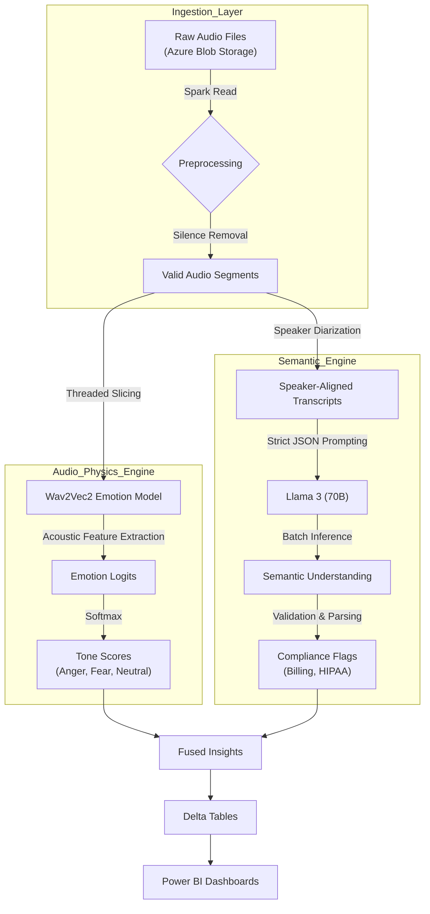

## Multimodal Healthcare Intelligence


> **A production-grade multimodal AI system that fuses acoustic emotion detection (Audio) with semantic sentiment analysis (Text) to automate quality assurance and compliance monitoring for healthcare patient interactions.**

---

## 🚀 Business Impact & Results

This system was deployed in a real-world healthcare environment to replace labor-intensive manual call audits with scalable, automated intelligence.

| Metric                   | Improvement        | Context                                                                      |
| :----------------------- | :----------------- | :--------------------------------------------------------------------------- |
| **💰 Cost Savings**      | **$31,000 / year** | Reduced operational overhead by minimizing manual QA reviews.                |
| **⚡ Compute Efficiency** | **12% Reduction**  | Optimized inference using PySpark batch execution and PyTorch thread tuning. |
| **⏱️ Time Saved**        | **10% Reduction**  | Faster issue detection via automated dashboards and alerts.                  |
| **📈 Scale**             | **50,000+ Files**  | Successfully processed large historical archives on Azure Databricks.        |

---

## 🧠 System Architecture

The platform is built on a **Lakehouse Architecture** using **Azure Databricks**, enabling scalable batch inference, fault tolerance, and analytics-ready outputs.

Raw call-center audio flows through two parallel intelligence engines—**Audio** and **Text**—before being fused into a unified analytical view.



---

## 🛠️ Technical Walkthrough

### Phase 1: Audio Physics Engine (`audio_emotion_spark.py`)

**Goal:** Detect *how* a patient is speaking—not just *what* they say.

Processing tens of thousands of call-center recordings required massive concurrency beyond standard Python execution models.

**Key Design Choices:**

* **Thread-Safe Model Loading** inside Spark executors to bypass Python GIL bottlenecks
* **Lazy Initialization** of GPU-backed models to avoid cold-start storms
* **Custom ThreadPoolExecutor** to fully saturate GPU cores on Databricks clusters

**Model:** `superb/wav2vec2-base-superb-er` (Emotion Recognition)

**Reliability:** Aggressive garbage collection and CUDA cache cleanup to prevent OOM failures during long-running batch jobs

```python
# Thread-safe lazy loading for GPU-bound emotion inference
class ThreadSafeEmotionModel:
    def get_model_and_processor(self):
        if not hasattr(self._local, "model"):
            self._local.model = Wav2Vec2ForSequenceClassification.from_pretrained(...)
        return self._local.model
```

---

### Phase 2: Semantic Llama Engine (`text_sentiment_spark.py`)

**Goal:** Understand context, intent, and compliance risk from conversations.

The semantic engine leverages **Llama 3 (70B)** via **Databricks Model Serving** to extract structured meaning from transcripts at scale.

**Challenges Addressed:**

* Non-deterministic LLM outputs under high concurrency
* Enforcing schema consistency for downstream analytics

**Solutions:**

* Strict **JSON-only system prompts** to guarantee structured outputs
* **Self-healing retry loops** that detect malformed responses
* Delta Lake–based reprocessing using `MERGE` for fault tolerance

**Extracted Signals:**

* Overall sentiment
* Issue resolution status
* Billing and compliance indicators

---

### Phase 3: Visualization & Insight

**Goal:** Make results actionable for clinicians and operations teams.

All outputs are materialized into **Delta Tables**, enabling seamless BI integration.

**Power BI Dashboards Enable:**

* 📊 **Sentiment Trends** — spikes in anger correlated with billing or care delays
* 🧑‍💼 **Agent Performance** — resolution rates vs. acoustic stress indicators
* ⚠️ **Compliance Monitoring** — early detection of potential policy violations


---

## ⚙️ Optimization Strategy

This system was engineered not just for accuracy—but for **cost efficiency and scale**.

* **Batch vs. Streaming:** PySpark batch processing for historical backfills reduced cluster uptime by **12%**
* **Thread Tuning:** Aligned `OMP_NUM_THREADS` and `torch.set_num_threads(6)` with Spark executor cores
* **GPU Utilization:** Warm-up strategies reduced cold-start latency by ~60%

---

## 🤝 Cross-Functional Alignment

Model outputs were co-designed with **clinicians and QA stakeholders** to ensure real-world relevance.

* Differentiated **pain vs. anger** in emotional signals
* Ensured outputs aligned with clinical and compliance workflows
* Validated insights through iterative feedback loops

---

## 💻 Installation & Usage

### Prerequisites

* Azure Databricks (Runtime **13.0+ ML**)
* GPU-enabled cluster (**T4 or A10 recommended**)
* HuggingFace API token

---

## 📌 Key Takeaway

> **This project demonstrates how multimodal AI—when engineered correctly—can deliver measurable business value, clinical insight, and scalable intelligence in regulated healthcare environments.**


```
🛠️ Technical Walkthrough
Phase 1: The Audio Physics Engine (audio_emotion_spark.py)
Goal: Detect HOW the patient is speaking, not just what they are saying.

Processing thousands of hours of audio requires massive concurrency. We bypassed standard Python limitations by implementing Thread-Safe Model Loading within Spark workers.

Model: superb/wav2vec2-base-superb-er (Fine-tuned for Emotion Recognition).

Optimization: Custom ThreadPoolExecutor implementation to saturate GPU cores on Databricks clusters.

Safety: Implemented aggressive memory cleanup (GC + CUDA Cache) to prevent OOM errors during long-running batch jobs.

Python
# Snippet: Thread-Safe Lazy Loading to maximize GPU throughput
class ThreadSafeEmotionModel:
    def get_model_and_processor(self):
        if not hasattr(self._local, 'model'):
             # Lazy load only when thread requires it
             self._local.model = Wav2Vec2ForSequenceClassification.from_pretrained(...)
        return self._local.model
Phase 2: The Semantic Llama Engine (text_sentiment_spark.py)
Goal: Understand context, intent, and compliance risks.

We utilized Llama 3 (70B) via Databricks Model Serving. The challenge was handling non-deterministic LLM outputs at scale.

Prompt Engineering: Designed strict "JSON-only" system prompts to force structured outputs ({overall_sentiment, issue_resolved, billing_detected}).

Self-Healing Data: Built a Retry Loop that identifies malformed JSON responses and re-processes them in micro-batches using Delta Lake MERGE operations.

Phase 3: Visualization & Insight
Goal: Make the data actionable for clinicians and operational managers.

The resulting Delta Tables feed into a Power BI Dashboard that visualizes:

Sentiment Trends: Identifying spikes in "Anger" correlated with specific billing issues.

Agent Performance: Heatmaps showing call resolution rates vs. acoustic sentiment.

(Place your dashboard screenshot here) 

⚙️ Optimization Strategy
We didn't just build models; we optimized them for cost and scale.

Batch Processing vs. Streaming: Switched to PySpark batch processing for historical backfills, reducing cluster uptime by 12%.

Resource Management: Tuned OMP_NUM_THREADS and torch.set_num_threads(6) to align PyTorch internal parallelism with Spark Executor cores, eliminating context-switching overhead.

Cross-Functional Alignment: Collaborated with Clinicians to define "Negative Sentiment" in a healthcare context (e.g., distinguishing "Pain" from "Anger"), ensuring the model aligned with clinical workflows.

💻 Installation & Usage
Prerequisites
Azure Databricks (Runtime 13.0+ ML)

GPU Cluster (T4 or A10 recommended)

HuggingFace API Token
